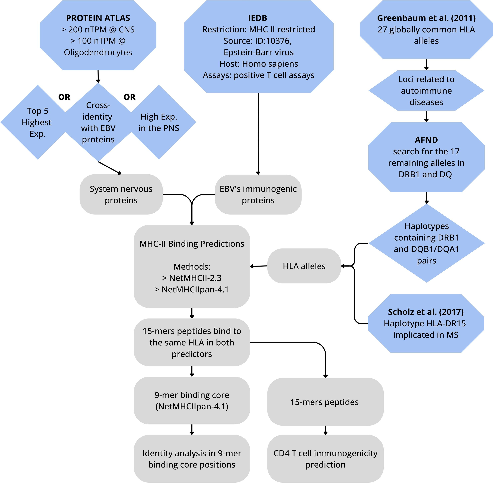

# Immuno-cross

Search possible cross-reactivity between the human nervous system and Epstein-Barr Virus (EBV) proteins.

## Description

*Immuno-cross* is a set of Python scripts that identifies critical contact residues of the T-cell receptor (TCR) based on sequence identity, developed by [Helmut K. A. Patrocínio](https://github.com/helkennedy) and Tayná S. Fiúza. Our approach helped to reveal that several peptides derived from the nervous system and Epstein-Barr virus (EBV) proteins share identical residues at these critical contact points. This suggests the possibility of cross-reactivity between them. The pipeline can be used to search for nonamer pairs from other sources and other human proteins.

## Folders content

The folder "files" contains data obtained from the consulted databases.

The folder "prediction" contains data obtained from HLA-binding predictions.

> *Some files of this folder are compressed (.tar.gz) due to size limitations.*

The folder "scripts" contains scripts created for data extraction and processing, as well as to compare the nonamer identity, as follows:

* ***Haplotypes.ipynb and Haplotypes.py*** - getting alleles and haplotypes
* ***prediction_treatment.ipynb and prediction_treatment.py*** - process data from allele-binding prediction, and generate nonamers fasta files 
* ***nonamers_identity_analysis.ipynb and nonamers_identity_analysis.py***- read nonamers fasta files, compare identity, and generate .xlsx files with the nonamers identity result.
* ***upset_plot.ipynb and upset_plot.py*** - read .xlsx files with the nonamers' identity results and generate upset plots.

## Dependencies

To execute the scripts, the following packages/libraries must be installed in your system/notebook:

- biopython>=1.79.

- matplotlib>=3.5.1.

- numpy>=1.22.1.

- openpyxl==3.0.9.

- pandas>=1.4.2.

- seaborn>=0.11.2.

- UpSetPlot==0.6.1.

- XlsxWriter==3.0.3.

- matplotlib-venn==0.11.7
  bs4==0.0.1.

They are also listed in the file requirements.txt, in the scripts folder.

## The Pipeline

The scheme below describes the methodology workflow that Immuno-cross uses to identify cross-identity peptides. 

The pipeline is organized in the following order:  

1. Run '*haplotypes*' (which generates files for '*nonamers_identity_analysis*').

2. Then '*prediction_treatment*' (which generates files for '*nonamers_identity_analysis*').

3. Now execute '*nonamers_identity_analysis*' (which generates files for '*upset_plot*').

4.  Run '*upset_plot*'.

>  *Ps.: All files are included, so you can run 'nonamers_identity_analysis' or 'upset_plot' scripts directly.*

We used the packages matplotlib ([https://matplotlib.org/](https://matplotlib.org/)) (version 3.5) and seaborn ([https://seaborn.pydata.org/](https://seaborn.pydata.org/)) (version 0.11.2) to build the graphs. For visualizing the identity analysis of the nonamers, we used the package UpSetPlot ([UpSetPlot documentation — upsetplot 0.8.0 documentation](https://upsetplot.readthedocs.io/en/stable/)) (v. 0.6.1).

## Citation

Preprint at BioRxiv:

[Patrocinio et al. 2023]().
